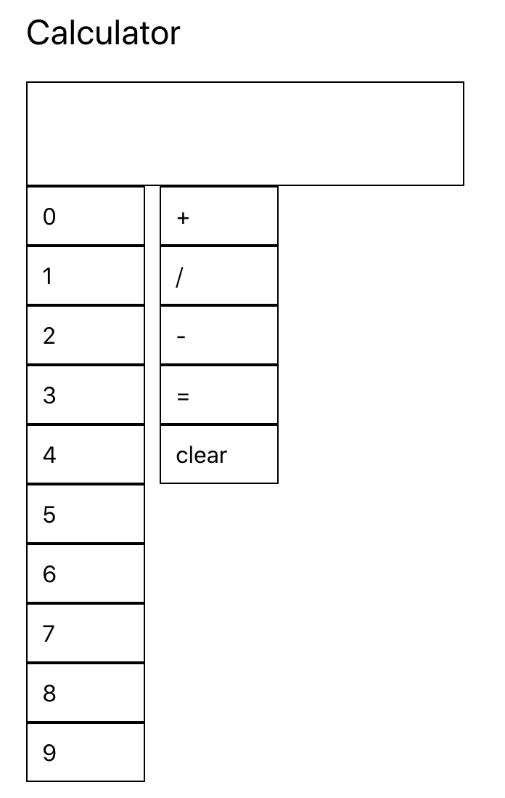

## Assignment

In this assignment you will start with a basic calculator and style it using `CSS`, `inline styles`, and `styled-components`.

As you can tell the current layout needs a lot of styling work. Modify the layout, components, and calculator logic however you want. Everything is free game!

## Deliverable

1. Style the calculator however you want. Feel free to use any colors, layout, and animations that you would like. Be as creative as you want.
2. Define all PropTypes for `Number`, `Operator`, and `Screen` components. If you add more components make sure to define the PropTypes.
3. Deploy your application using any method you want (repo is setup for Github actions). Add the url: URL_TO_PROJECT

### Deployment Instructions (Github actions)

- Go to `Settings`
- Go to `Pages`
- in `Source`, select `gh-pages` branch
- Click Save
- In `package.json`, add a new key/value as: `"homepage": "https://prof-tejera.github.io/<repo>"`

Once the `build-deploy` action finishes running, the app should be live
at `https://prof-tejera.github.io/<repo>`

For other ways to deploy see https://github.com/prof-tejera/react-deployment-code

## Bonus Points

1. Add support for decimal places.
2. Add support for negative numbers.
3. How are you handling the overflow of text? How might we handle situations in which we are dealing with really large numbers?

## How to run the project

`npm i && npm start`

Open [http://localhost:3000](http://localhost:3000)
